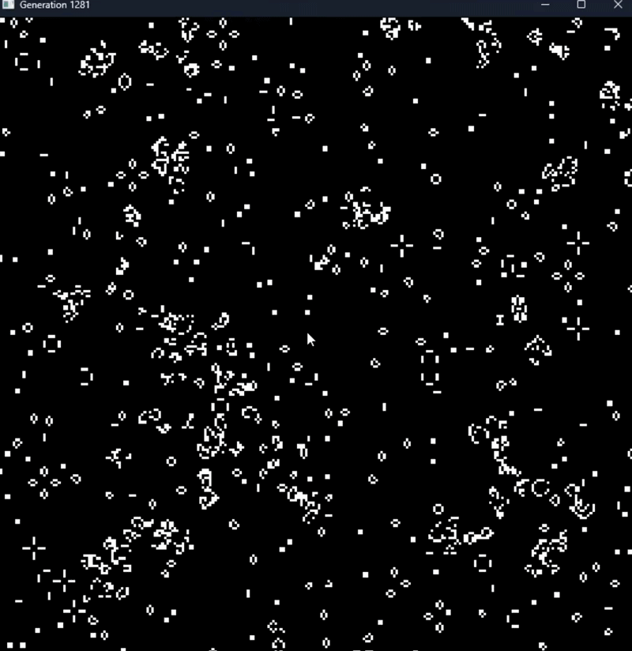

# 🧠 Neural Game of Life

A convolutional neural network that learns to simulate **Conway's Game of Life**.

Instead of applying the handcrafted cellular automata rules, the model predicts the next board state through neural network inference. The simulation runs in real time using **PyTorch** and **VisPy**.

---

## ✨ Features

- 🧠 CNN predicts the next generation
- ⚡ GPU acceleration with PyTorch
- 🎮 Real-time visualization with VisPy
- 📈 Large 1000×1000 simulation grids
- 🔬 AI learns deterministic cellular automata

---

## 🎥 Demo



---

## ⚙️ How It Works

1. 🎲 Generate a random Game of Life board.
2. 🧠 Feed the board into the pretrained CNN.
3. 📊 Predict the next generation.
4. ✅ Apply a threshold to produce alive/dead cells.
5. 🔁 Repeat continuously.

---

## 🏗️ Model

```
Input
  ↓
Conv2D (1 → 16)
  ↓
ReLU
  ↓
Conv2D (16 → 16)
  ↓
ReLU
  ↓
Conv2D (16 → 1)
  ↓
Sigmoid
  ↓
Threshold
  ↓
Output
```

The network was trained on examples generated using the original Conway's Game of Life rules.


